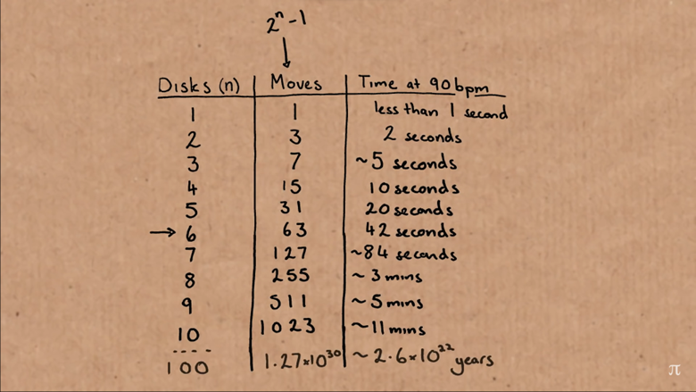
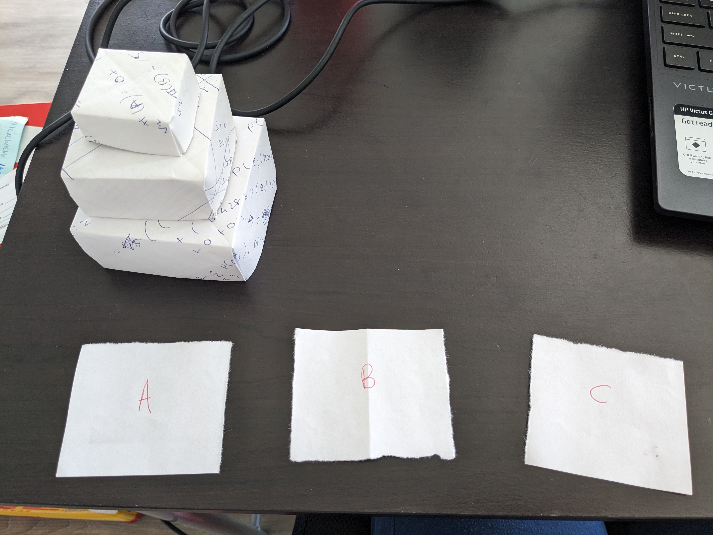
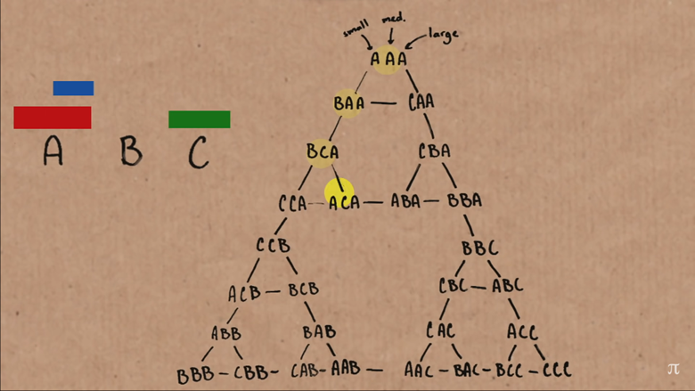

# The Tower of Hanoi

The Tower of Hanoi is a classic puzzle or mathematical problem that involves moving a stack of disks from one peg or rod to another, subject to certain constraints. The puzzle consists of three rods and a number of disks of different sizes, which can slide onto any rod. The puzzle is usually represented as follows:

There are three **rods** (A, B, and C).  
There are n **disks** of different sizes, initially stacked in decreasing order of size on one rod (e.g., rod A).
The task is to move all the disks from the starting rod (e.g., rod A) to the destination rod (e.g., rod C), using the third rod (e.g., rod B) as an auxiliary, following these rules:  
**a. Only one disk can be moved at a time.**  
**b. A disk can only be placed on top of a larger disk or an empty rod.**  

The puzzle is usually solved recursively. Here's a general algorithm for solving the Towers of Hanoi with n disks:  

- Move the top n-1 disks from the source rod (A) to the auxiliary rod (B) using the destination rod (C) as an auxiliary.  
- Move the largest disk from the source rod (A) to the destination rod (C).  
- Move the n-1 disks from the auxiliary rod (B) to the destination rod (C) using the source rod (A) as an auxiliary.  

This algorithm is applied recursively until all the disks are moved from the source rod to the destination rod. The key to solving the problem is understanding that you can break it down into smaller subproblems, solving them in the same way.  

The Towers of Hanoi puzzle is a classic example in computer science and recursion, often used to teach concepts like recursion and algorithmic thinking. The minimum number of moves required to solve the puzzle with n disks is 2^n - 1.  

This is the Time it would approximately take for moving the Tower of Hanoi by taking the optimal path, as the number of discs increase.  
 ~ [Source: Numberphile]

Look! I made a tower using Origami-boxes.

Sierpinski Triangle for 3 Discs. ~ [Source: Numberphile]
