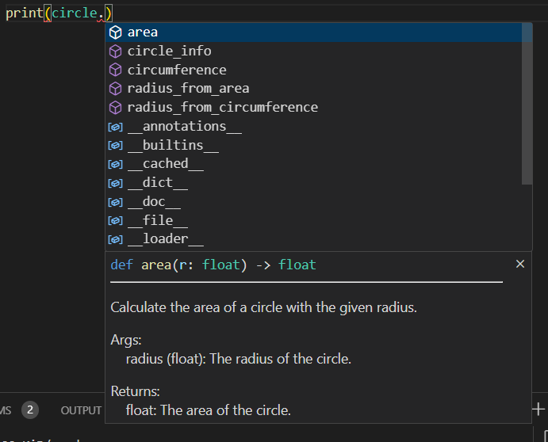

interface files and stubs are related to type hinting and static analysis tools like Mypy. They help improve code readability, 
maintainability, and catch potential type-related errors before runtime.

.pyi files are known as "type hint stub files." These files are used for type hinting and static analysis purposes and contain type annotations 
and declarations without actual implementations of the code. .pyi files are typically used in situations where you want to provide type hints 
for modules, classes, functions, or methods but don't want to include the actual code.

