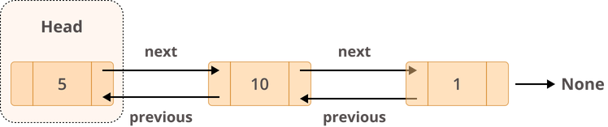
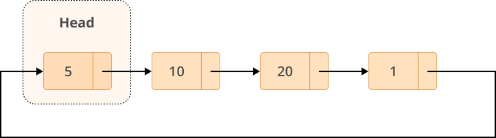

# About Linked Lists

- each element of a linked list is called a **node**
- every **node** has two different fields:
    - **Data** contains the value to be stored in the node
    - **Next** contains a reference to the next node on the list

- A linked list is a collection of nodes.
- The first node is called the **head**, and it's used as the starting point for any iteration through the list.
- The last node must have its **next** reference pointing to *None* to determine the end of the list.


## Applications
- Implementing queues (FIFO), stacks (LIFO) and graphs (Adjacency List).
- Lifecycle management for an operating system application.

## Insertion and Deletion
.append() = insert at end of list
.pop() = delete at end of list

.insert() = insert at a specific positions in a list
.remove() = remove at a specific positions in a list

## Retrieval of Elements
When it comes to element lookup, lists perform much better than linked lists. When you know which element you want to access, lists can perform this operation in O(1) time. Trying to do the same with a linked list would take O(n) because you need to traverse the whole list to find the element.

When searching for a specific element, however, both lists and linked lists perform very similarly, with a time complexity of O(n). In both cases, you need to iterate through the entire list to find the element you’re looking for.

## collections.deque
- double-ended queue
- can access, insert, or remove elements from the beginning or end of a list with constant O(1) performance.

```py
>>> deque(['a','b','c'])
deque(['a', 'b', 'c'])

>>> deque('abc')
deque(['a', 'b', 'c'])

>>> deque([{'data': 'a'}, {'data': 'b'}])
deque([{'data': 'a'}, {'data': 'b'}])
```

```py
>>> llist = deque("abcde")
>>> llist
deque(['a', 'b', 'c', 'd', 'e'])

>>> llist.append("f")
>>> llist
deque(['a', 'b', 'c', 'd', 'e', 'f'])

>>> llist.pop()
'f'

>>> llist
deque(['a', 'b', 'c', 'd', 'e'])

>>> llist.appendleft("z")
>>> llist
deque(['z', 'a', 'b', 'c', 'd', 'e'])

>>> llist.popleft()
'z'

>>> llist
deque(['a', 'b', 'c', 'd', 'e'])
```

## Doubly Linked Lists

Doubly linked lists are different from singly linked lists in that they have two references:
    - The previous field references the previous node.
    - The next field references the next node.



`collections.deque` uses this type of linked list as part of it's data structure.

## Circular Linked Lists

Circular linked lists are a type of linked list in which the last node points back to the head of the list instead of pointing to None. This is what makes them circular. Circular linked lists have quite a few interesting use cases:

    - Going around each player’s turn in a multiplayer game
    - Managing the application life cycle of a given operating system
    - Implementing a Fibonacci heap


