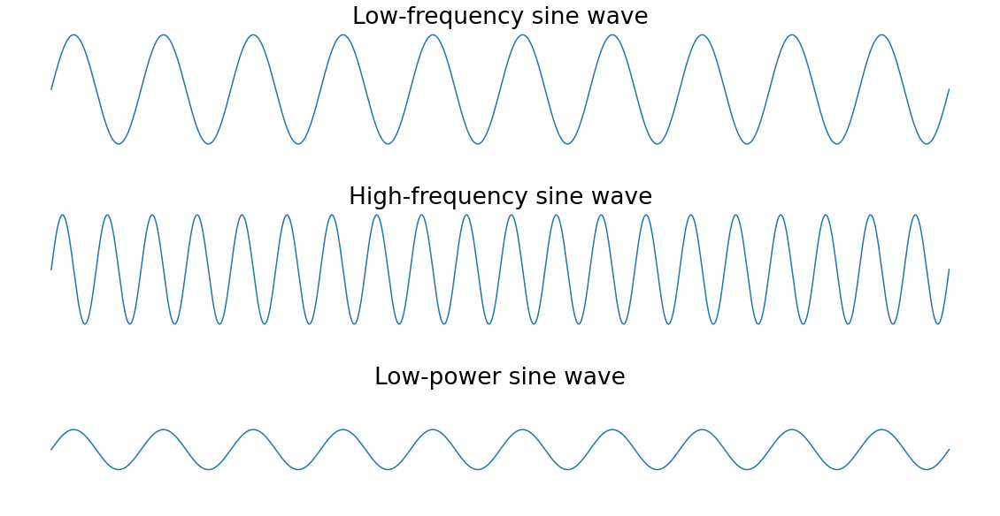
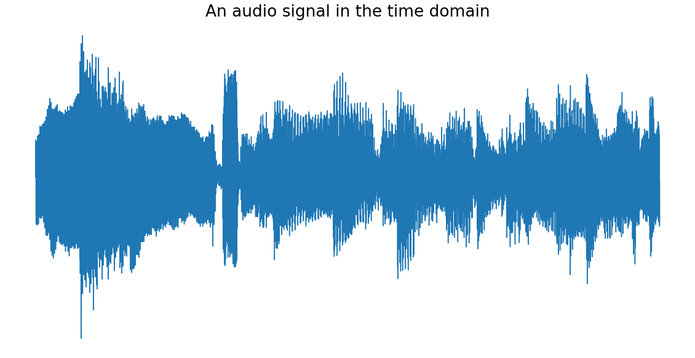
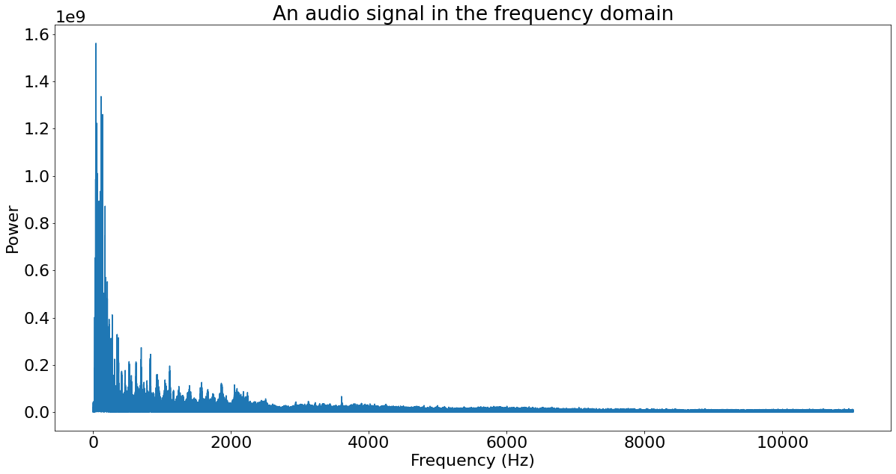

# Fourier Transforms

- The Fourier transform is a powerful tool for analyzing signals and is used in everything from audio processing to image compression.
- SciPy provides a mature implementation in its scipy.fft module

## scipy.fft vs scipy.fftpack
When looking at the SciPy documentation, you may come across two modules that look very similar:

- scipy.fft
- scipy.fftpack

The scipy.fft module is newer and should be preferred over scipy.fftpack.

## scipy.fft vs numpy.fft
SciPy’s fast Fourier transform (FFT) implementation contains more features and is more likely to get bug fixes than NumPy’s implementation. If given a choice, you should use the SciPy implementation.

NumPy maintains an FFT implementation for backward compatibility even though the authors believe that functionality like Fourier transforms is best placed in SciPy. 

## The Fourier Transform
Fourier analysis is a field that studies how a mathematical function can be decomposed into a series of simpler trigonometric functions. The Fourier transform is a tool from this field for decomposing a function into its component frequencies.

    - A signal is information that changes over time. For example, audio, video, and voltage traces are all examples of signals.
    - A frequency is the speed at which something repeats. For example, clocks tick at a frequency of one hertz (Hz), or one repetition per second.
    - Power, in this case, just means the strength of each frequency.

The peaks of the high-frequency sine wave are closer together than those of the low-frequency sine wave since they repeat more frequently. The low-power sine wave has smaller peaks than the other two sine waves.

## Why would I use Fourier Transform?

- The Fourier transform is useful in many applications. 
- For example, 
    - Shazam and other music identification services use the Fourier transform to identify songs. 
    - JPEG compression uses a variant of the Fourier transform to remove the high-frequency components of images. 
    - Speech recognition uses the Fourier transform and related transforms to recover the spoken words from raw audio.

In general, you need the Fourier transform if you need to look at the frequencies in a signal. If working with a signal in the time domain is difficult, then using the Fourier transform to move it into the frequency domain is worth trying. 

## Time Domain vs Frequency Domain

- In the time domain, a signal is a wave that varies in amplitude (y-axis) over time (x-axis).

- In the frequency domain, a signal is represented as a series of frequencies (x-axis) that each have an associated power (y-axis). 

## Types of Fourier Transforms

- The most basic subdivision is based on the kind of data the transform operates on: continuous functions or discrete functions. 
- The fast Fourier transform (FFT) is an algorithm for computing the discrete Fourier transform (DFT), whereas the DFT is the transform itself.

## Mixing Audio Signals & Filtering the Signal Example

- The signal will be like a distorted sine wave. The sine wave we'll see is the 400 Hz tone we generated, and the distortion is the 4000 Hz tone. 

- Use the FFT on your generated audio. The FFT is an algorithm that implements the Fourier transform and can calculate a frequency spectrum for a signal in the time domain

- We can see two peaks in the positive frequencies and mirrors of those peaks in the negative frequencies. The positive-frequency peaks are at 400 Hz and 4000 Hz, which corresponds to the frequencies that you put into the audio.

- The Fourier transform has taken our complicated, wibbly signal and turned it into just the frequencies it contains. Since you put in only two frequencies, only two frequencies have come out. The negative-positive symmetry is a side effect of putting real-valued input into the Fourier transform.

- The frequency spectrum that fft() outputted was reflected about the y-axis so that the negative half was a mirror of the positive half. This symmetry was caused by inputting real numbers (not complex numbers) to the transform.
You can use this symmetry to make your Fourier transform faster by computing only half of it. scipy.fft implements this speed hack in the form of rfft().

- One great thing about the Fourier transform is that it’s reversible, so any changes you make to the signal in the frequency domain will apply when you transform it back to the time domain.

- The values returned by rfft() represent the power of each frequency bin. If you set the power of a given bin to zero, then the frequencies in that bin will no longer be present in the resulting time-domain signal.

- Next, we'll apply the inverse Fourier transform to get back to the time domain.

**The above example is more for educational purposes than real-world use. Replicating the process on a real-world signal, such as a piece of music, could introduce more buzz than it removes.**

**In the real world, you should filter signals using the filter design functions in the scipy.signal package. Filtering is a complex topic that involves a lot of math.**

