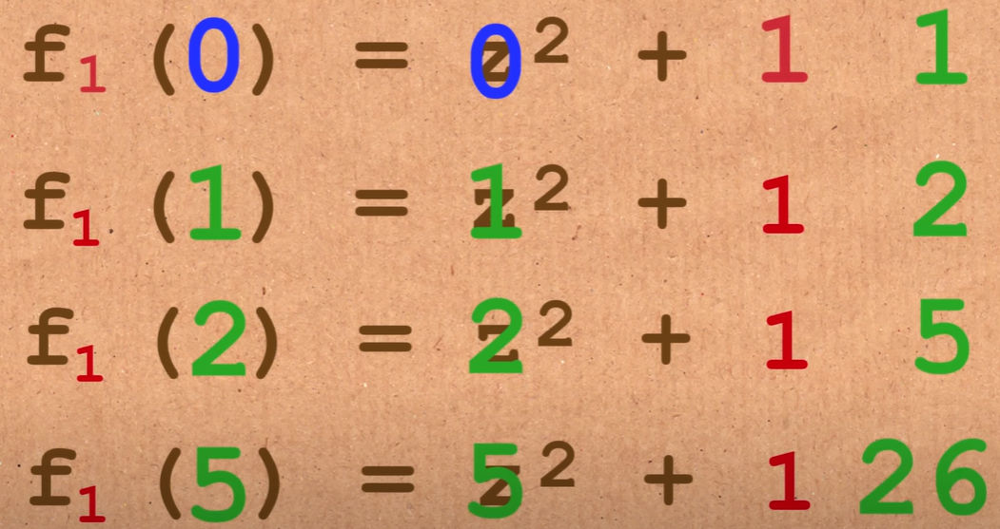
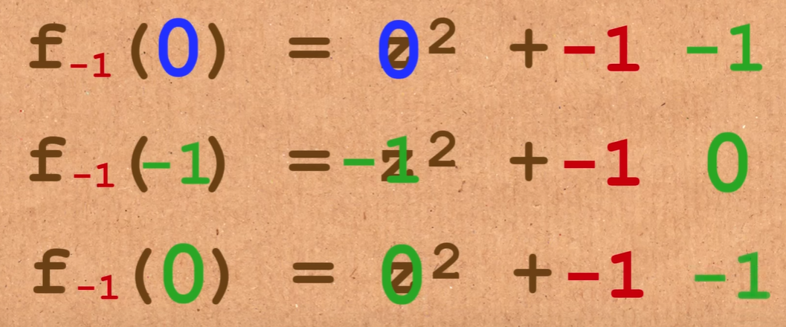

# The Mandelbrot Set

The Mandelbrot set is a famous mathematical set of points in the complex plane, which has distinctive and visually appealing fractal properties. It is named after Benoît B. Mandelbrot, who first introduced it in 1980.

The set is defined by iterating a simple mathematical formula on each point in the complex plane and determining whether the resulting sequence remains bounded or not. The formula is:

The Mandelbrot set is typically visualized by assigning colors to points based on the number of iterations required for the sequence to exceed the threshold. Points inside the set are often colored black, while the boundary points exhibit intricate and self-replicating patterns that make up the famous fractal structure.

The visual representation of the Mandelbrot set is known for its complexity and beauty, revealing intricate patterns at different scales. It has become an iconic example of the beauty of mathematics and is widely used in computer graphics and art. 

## What is the Mandelbrot Set?

Consider, equation:
$f_{1}(z) = z^{2}+C$

- Case 1: Blows Up: Value gets larger as we iterate 0 (when $C = 1$, so $f_{1}(z) = z^{2}+1$)

- Case 2: Stays Small: Value oscialltes between -1 and 0 as we iterate 0 (when $C=-1$, so $f_{1}(z) = z^{2}-1$)

So, $M$ the Mandelbrot set is the set of complex numbers $c$ for which Case (2) holds True.

The Mandelbrot set is a fascinating mathematical object that has captured the interest of scientists, mathematicians, and enthusiasts alike for several reasons:
- Self-Similarity at Different Scales:

The Mandelbrot set exhibits intricate and infinitely complex patterns at various scales. As you zoom into different regions of the set, you discover similar patterns repeating at different magnifications. This self-similarity is both beautiful and intriguing.

- Fractal Nature:

The Mandelbrot set is a fractal, a geometric shape that displays self-similar patterns at every level of magnification. Fractals have applications in diverse fields, including computer graphics, art, and even the modeling of natural phenomena like coastlines and clouds.

- Simple Rule, Complex Behavior:

The Mandelbrot set is generated by a relatively simple mathematical rule. The set is defined by iterating a simple mathematical operation on complex numbers. Despite the simplicity of the rule, the behavior becomes extremely complex and unpredictable.

- Boundary Between Order and Chaos:

The boundary of the Mandelbrot set is a complex, infinitely detailed fractal curve. This boundary separates points that remain bounded under iteration from points that eventually escape to infinity. This transition between order and chaos is a fascinating aspect of the Mandelbrot set.

## Julia Set

It’s hard to talk about the Mandelbrot set without mentioning Julia sets, which had been discovered by French mathematician Gaston Julia several decades earlier without the help of computers. Julia sets and the Mandelbrot set are closely related because you can obtain them through the same recursive formula, only with different sets of starting conditions.

While there’s only one Mandelbrot set, there are infinitely many Julia sets. So far, you always started the sequence at z0 = 0 and systematically tested some arbitrary complex number, c, for its membership. On the other hand, to find out if a number belongs to a Julia set, you must use that number as the starting point for the sequence and pick another value for the c parameter.