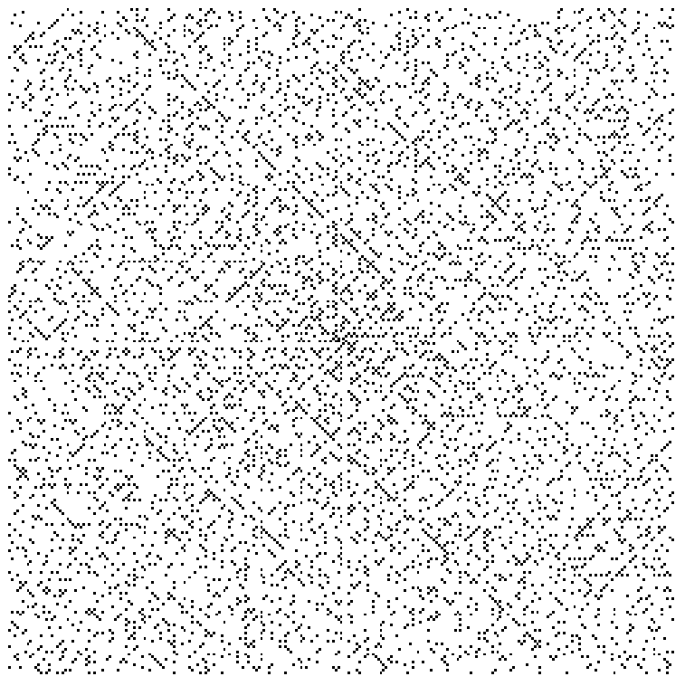

# The Ulam Spiral

The Ulam spiral or prime spiral is a graphical depiction of the set of prime numbers, devised by mathematician Stanisław Ulam in 1963 and popularized in Martin Gardner's Mathematical Games column in Scientific American a short time later.

The Ulam spiral is a graphical depiction of the set of prime numbers, arranged in a spiral. The number spiral is constructed by writing the positive integers in a spiral arrangement on a square lattice.

It is produced by specially marking the prime numbers to obtain a figure.

The Ulam spiral is constructed by writing the positive integers in a spiral arrangement on a square lattice: 

and then marking the prime numbers: 

In the figure above, primes appear to concentrate along certain diagonal lines. 

In the 251×251 Ulam spiral shown below, diagonal lines are clearly visible, confirming that the pattern continues. Horizontal and vertical lines with a high density of primes, while less prominent, are also evident.

 Most often, the number spiral is started with the number 1 at the center, but it is possible to start with any number, and the same concentration of primes along diagonal, horizontal, and vertical lines is observed. Starting with 41 at the center gives a diagonal containing an unbroken string of 40 primes (starting from 1523 southwest of the origin, decreasing to 41 at the origin, and increasing to 1601 northeast of the origin), the longest example of its kind. ~[Wiki]

**So, Prime Numbers are not as random as we might think of, there are equations that help us find prime numbers.**

